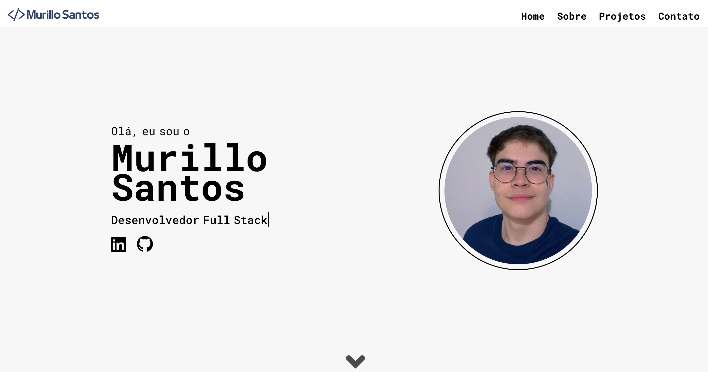

# Meu Portfólio

## Introdução

Este repositório contém informações e projetos que demonstro minhas habilidades como desenvolvedor Full Stack.
Desenvolvi este portfólio utilizando React, HTML, CSS e JavaScript.

## Pre-requisitos

Antes de executar este projeto, certifique-se de ter as seguintes dependências instaladas:

- [Node.js](https://nodejs.org/) e [npm](https://www.npmjs.com/) para execução do servidor e gerenciamento de pacotes.

## Como Iniciar

1. Clone esse repositório.
2. Instale as dependencias: `npm install`.
3. Inicie o servidor: `npm start`.
